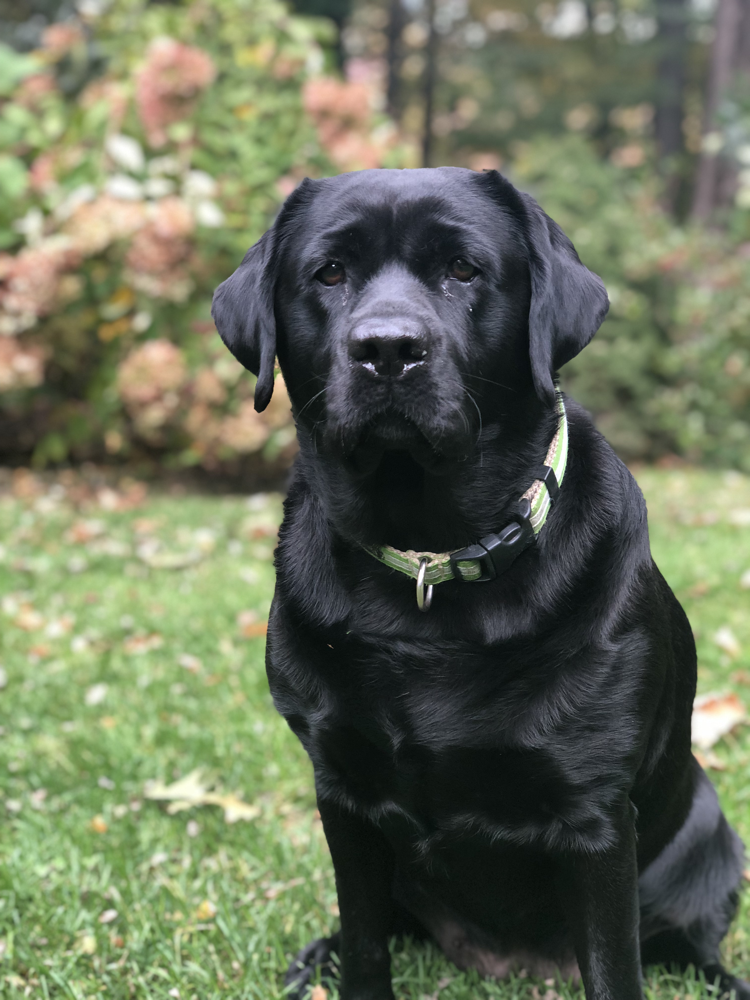

My name is Tess Bloomquist. I grew up in Branford CT and moved to NYC after graduating from Trinity College in 2016 with a BS in Neuroscience. Currently I work in Andrea Baccarelli's lab at Columbia Mailman School of Public Health as a Project Coordinator in the [Laboratory of Precision Environmental Biosciences](https://www.mailman.columbia.edu/research/laboratory-precision-environmental-health). 

I love my family and try to visit them in CT as often as possible. I have one older brother and two younger sisters who keep me on my toes. We also have 2 wonderful labs, Lucy and Rory, and a large cat named Moose. 

Outside of work I love to practice yoga, run, hike, visit farmers markets, and spend as much time outside as possible. 

