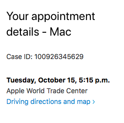

# This is Jeff's awesome website

You can learn about me [here](about-me.html)

# let's add some links

So, to link to my favorite tool for data science, I’d use [this](https://google.com)

# this is a screenshot

